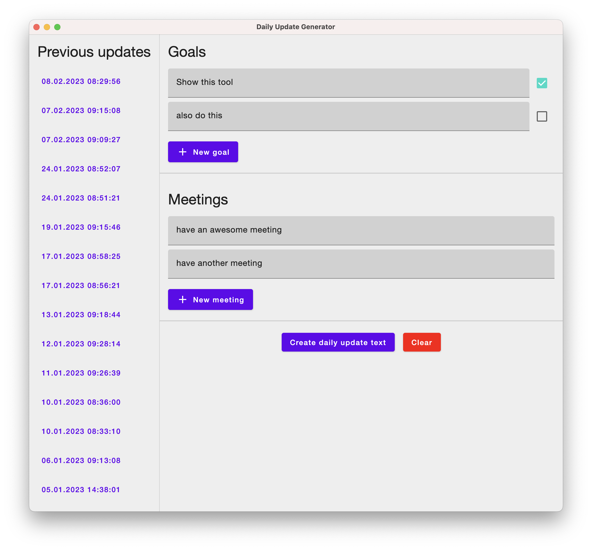
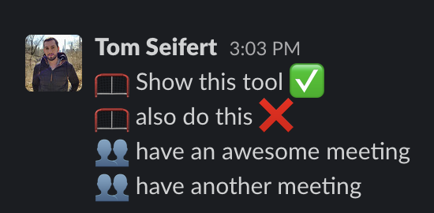

# WrittenDailyUpdateGenerator

A Jetpack Compose Desktop app to simplify generation of texts for a _written daily stand-up_, consisting
of a list of goals for a day and what meetings one will attend.

This tool persists each generated text in a local SQLite database, so one can view
the history of generated texts and check which goal of a previous day has been achieved
or failed.

Built for my personal usage.

The tool generates the following output

